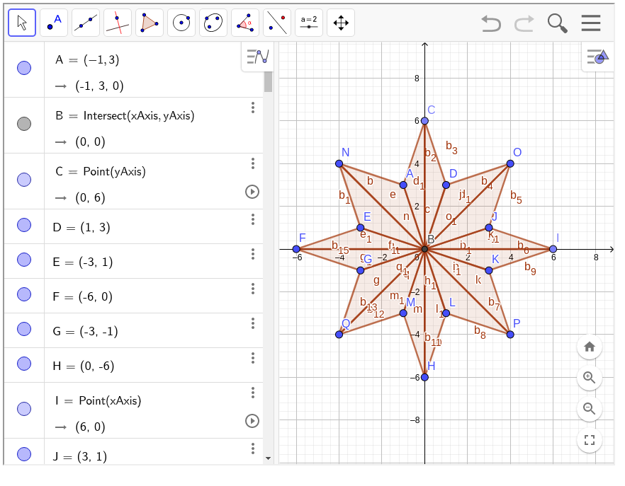

Learning to draw stuff with opengl. The program draws a glowing start with random colors appearing on it.

The coordinates of the star were made on this website. 
"""

https://www.math10.com/en/geometry/geogebra/geogebra.html

"""

This code requires, to be installed to run:
- glm
- glfw3
- sfml

Linux : 
From this directory " LearnOpenglCpp/res_code " where the main.cpp is located.
To execute the code you can type ./compile.sh in the terminal.
